## Aku dan nasionalisme

Entah awalnya bagaimana aku sendiri bisa sampai "dipertemukan" dengan Tan Malaka. Sejak kecil, aku telah memiliki ketertarikan mendalam terhadap nasionalisme dan sejarah berdirinya tanah air ini. Mungkin inilah yang secara tidak langsung mempertemukanku dengan pemikiran Tan Malaka.

Aku sendiri masih teringat betul masa-masa di Sekolah Dasar, ketika setiap ulangan pelajaran PKn (sekarang PPKn) selalu kutunggu dengan penuh semangat. Dan nilai hasil dari ulangan tersebut memang selalu memuaskan dan membuat perasaanku cukup bangga pada waktu itu. Mungkin, nilai PKn itu juga yang menjadi salah satu pendorong kenapa aku selalu berada di 3 besar pada saat di bangku Sekolah Dasar.

Tak hanya itu, ada sebuah program televisi di TvOne yang selalu meninggalkan kesan mendalam di ingatanku. Program tersebut bernama Riwadjatmoe Doeloe. Selalu kutonton setiap kali tayang di TV. Sosok Anto Djadoel, dengan setelan jas putih ala Sukarno, kacamata bundar yang mengingatkanku pada Harry Potter, dan topi khasnya (topi demang), berhasil menyuguhkan nuansa tema sejarah era zaman kolonialisme yang hidup kembali. Dengan gaya penyampaian yang khas, Anto mengayuh sepeda onthelnya dari satu situs bersejarah ke situs lainnya, diselingi logat Jawa-nya yang medok dan kamera jadul yang menggantung di lehernya, ia membawa penonton menyelami cerita-cerita perjuangan masa lalu yang sarat akan makna.

Program inilah yang turut mengasah pemahamanku tentang sejarah, terutama sebagai pendukung pembelajaran PKn di masa kecil. Di saat itu, materi sejarah mendominasi pelajaran PKn di Sekolah Dasar, sedangkan di jenjang yang lebih tinggi seperti SMP keatas, pendalaman mengenai undang-undang dan aspek lainnya baru mulai dibahas.

Semoga saja sekarang ini ada kembali program-program serupa yang tidak hanya mengedukasi tetapi yang juga bisa membakar semangat kecintaan terhadap tanah air.

Dengan latar belakang itulah, tulisan kali ini hendak mengulas salah satu karya awal Tan Malaka berjudul <u>Parlemen atau Soviet</u>. Buku ini merupakan pintu gerbang bagi pemikiran Tan Malaka yang nantinya akan menjadi dasar gagasannya di kemudian hari. Namun, sebelum kita menyelami isi karya tersebut, mari kita kenali terlebih dahulu siapa Tan Malaka sebenarnya.

## Tan Malaka

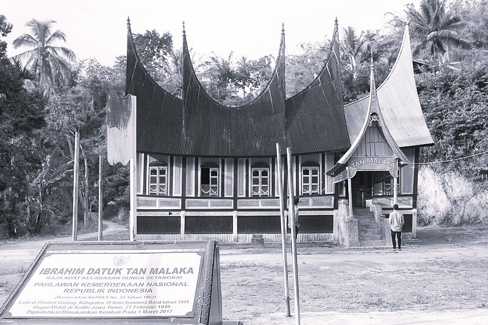

Tan Malaka adalah salah satu tokoh revolusioner Indonesia yang bisa dikatakan bahwa aku sendiri adalah penggemar berat dari beliau, mulai dari  pemikirannya, karyanya dan pergerakkannya. Ketika tulisan ini aku buat pun, poster-poster Tan Malaka yang aku tempel di dinding kamar terlihat menjadi pendorong untukku agar 'tuk menyampaikan warisan dari pikiran-pikirannya kepada massa, di zamanku, di generasiku.

### Sekelibat potongan sejarah Tan Malaka

Tan Malaka yang nama aslinya adalah Ibrahim atau nama lengkapnya Ibrahim gelar Datuk Sutan Malaka, lahir pada tanggal 2 Juni 1897, di tengah budaya Minangkabau, di sebuah nagari yang kental dengan tradisi dan nilai-nilai lokal. Dari kecil, Tan Malaka menurut literatur sejarah sudah dikenalkan pada ilmu agama dan seni bela diri, tapi yang menarik, dikatakan ia akhirnya menuntut ilmu ke Belanda untuk menjadi seorang guru di kemudian harinya nanti.

Di sana, di tengah suasana Eropa yang dingin dan berbeda jauh dari kampung halamannya, benak Tan Malaka mulai digerakkan oleh pemikiran revolusioner. Di sinilah ia mulai merasakan getaran perubahan, dari ide-ide Marxisme hingga inspirasi revolusi yang terus menggelora dalam dirinya.

Setelah kembali ke tanah air, Tan Malaka tak mau tinggal diam. Ia memilih untuk terjun langsung ke dunia pengajaran, jurnalisme, dan aktivisme. Dengan semangat yang membara, Tan Malaka menggunakan pena dan pengetahuannya untuk menantang tatanan kolonial yang menindas pada saat itu. Gaya kepemimpinannya yang dikatakan radikal dan keberaniannya dalam menyuarakan kebenaran membuat namanya melekat sebagai figur yang selalu mengusik status quo. Bayangkan saja oleh kita, di tengah situasi yang penuh tekanan, ia tetap berusaha mengobarkan bara perlawanan, sebuah sikap yang kadang buat kita teringat,

“Kapan kita juga bisa seberani Tan Malaka.”

Kehidupan tidak selamanya selalu mulus, perjalanan Tan Malaka juga pun penuh dengan liku dikarenakan semangat perlawanan terhadap kolonialisme di Tanah Airnya. Ia sempat terpaksa mengasingkan diri ke Eropa dan Asia, menggunakan berbagai nama samaran baru dan menghadapi kenyataan pahit di perantauan. Di tengah kesendirian dan kerasnya hidup di luar negeri, Tan Malaka terus mengasah pemikiran kritisnya. Ia menulis dan merenung tentang bagaimana revolusi bisa jadi jalan untuk mewujudkan perubahan bagi tanah airnya, meskipun kadang ide-idenya terlihat paradoks. Di masa-masa sulit itu, ia mempertanyakan segalanya, termasuk apakah revolusi adalah satu-satunya jawaban, atau mungkinkah ada cara lain untuk mencapai keadilan?

Meskipun perjuangannya dipenuhi rintangan dan pengasingan, warisan pemikiran Tan Malaka terus hidup sampai sekarang. Salah satunya melalui karya awal Tan Malaka yang berjudul Parlemen atau Soviet ini.

## Parlemen atau Soviet

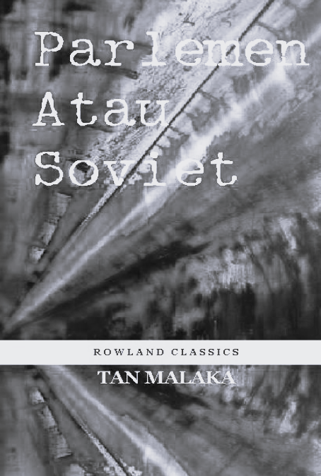

Parlemen atau Soviet adalah karya yang ditulis oleh Tan Malaka satu abad yang lalu, pada tahun 1921. Di buku ini, Tan Malaka mengupas pertentangan mendasar antara dua sistem pemerintahan:

1. <b>Sistem Parlementer</b>: Sistem ini dikritik Tan Malaka sebagai struktur yang katanya secara formal mengusung kedaulatan rakyat, pada praktiknya justru melayani kepentingan elit alias menjadi lembaga yang justru jadi pangkalan elit kapitalis. Parlemen dianggap telah terjebak dalam birokrasi dan retorika yang tidak mampu mewakili aspirasi nyata kaum buruh.

2. <b>Sistem Soviet</b>: Tan Malaka mengajukan sistem Soviet sebagai alternatif yang mewakili kekuasaan langsung rakyat. Soviet, yang muncul dari perjuangan kelas, dianggap sebagai model pemerintahan di mana keputusan diambil secara partisipatif oleh rakyat sendiri, bukan oleh perwakilan yang telah terkontaminasi kepentingan modal.

Inti dari buku ini merupakan analisis mendalam Tan Malaka tentang bagaimana struktur politik yang ada berakar pada sistem kapitalis, dan bagaimana alternatif revolusioner dapat membuka jalan menuju pembebasan kaum pekerja.

### BAB I: Parlemen Sebagai Perkakas Saja Dari Yang Memerintah

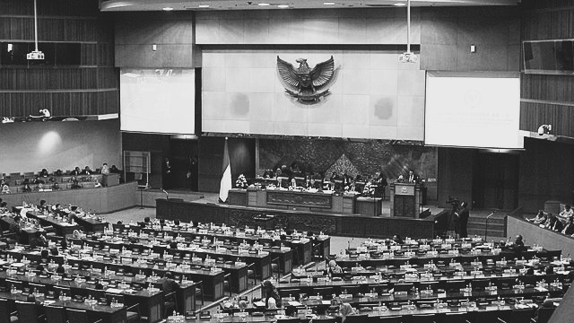

Pada bab ini, Tan Malaka mengajak kita untuk melihat lebih dekat sebuah ironi besar bagaimana lembaga negara khususnya parlemen yang katanya mewakili kedaulatan rakyat, justru seringkali menjadi alat bagi mereka yang berkuasa untuk mempertahankan kekayaan dan statusnya.

Tan Malaka menjelaskan bahwa pembentukan parlemen di Eropa, terutama di Inggris, bukanlah sesuatu yang terjadi dengan damai. Bayangkan saja, para raja yang dulu memegang kendali mutlak harus menghadapi gelombang perlawanan dari rakyat yang menuntut haknya.

Disini disinggung mengenai peristiwa penting seperti munculnya tuntutan rakyat melalui dokumen-dokumen seperti “Declaration of Right”, yang semacam janji kesetaraan dan pengakuan terhadap hak rakyat. Pernyataan ini lahir dari konflik panjang antara monarki dan kaum yang menolak penindasan. Suatu gambaran betapa kerasnya perjuangan agar suara rakyat akhirnya didengar.

Selain itu, Tan Malaka juga mengingatkan kita bahwa sejarah pembentukan parlemen penuh dengan peristiwa di mana rakyat rela bertarung, bahkan harus menanggung penderitaan akibat kekerasan aparat negara dan kebijakan raja yang otoriter. Ini adalah gambaran nyata dari bagaimana rakyat mulai menyadari bahwa struktur negara yang ada hanya mengukuhkan kekuasaan elit, bukan keadilan sosial yang sesungguhnya.

Dari cerita sejarah yang disampaikan, apa arti sebenarnya dari “parlemen” itu?

Menurut Tan Malaka, meskipun lembaga ini sering diibaratkan sebagai simbol kedaulatan rakyat, pada kenyataannya banyak kompromi dan penindasan yang terjadi di balik dinding-dinding birokrasi.

Di balik retorika muluk tentang “suara rakyat” yang sudah terdengar basi, parlemen itu kerap kali telah menjadi alat untuk menjaga status quo. Sejarah konflik antara raja dan rakyat yang diceritakan Tan Malaka menunjukkan bahwa sistem yang dibangun atas dasar perlawanan itu justru seringkali dimanfaatkan oleh para penguasa untuk mempertahankan kekuasaannya.

Kisah-kisah perlawanan yang diceritakan pada buku tersebut, seperti saat rakyat bersatu menuntut hak mereka lewat deklarasi, mengajarkan bahwa perubahan sesungguhnya hanya bisa terjadi <b>bila rakyat benar-benar diberdayakan</b>.

Tan Malaka seolah mengingatkan kepada kita bahwa,

“Jangan hanya terbuai oleh retorika, karena di balik itu ada sejarah pahit perjuangan yang terus berulang.”

Peristiwa-peristiwa sejarah yang diceritakan membuat kita sadar bahwa tidak ada sistem yang sempurna sejak awal mula. Pembentukan parlemen merupakan hasil dari konflik, pengorbanan, dan perlawanan yang tak kenal lelah.

Walaupun zaman telah berubah, kritik Tan Malaka masih sangat relevan. Pertanyaan tentang siapa yang benar-benar diuntungkan oleh struktur negara tetap menjadi tanda tanya. Apakah lembaga yang ada benar-benar mewakili suara rakyat, atau hanya menjadi perpanjangan tangan para elit belaka?

Seperti halnya semangat perlawanan yang mengakar dalam sejarah, kita harusnya selalu mempertanyakan dan mencari cara agar suara rakyat benar-benar didengar, bukan sekedar menjadi simbol atau retorika politik!

### BAB II: Parlemen Yang Sejati

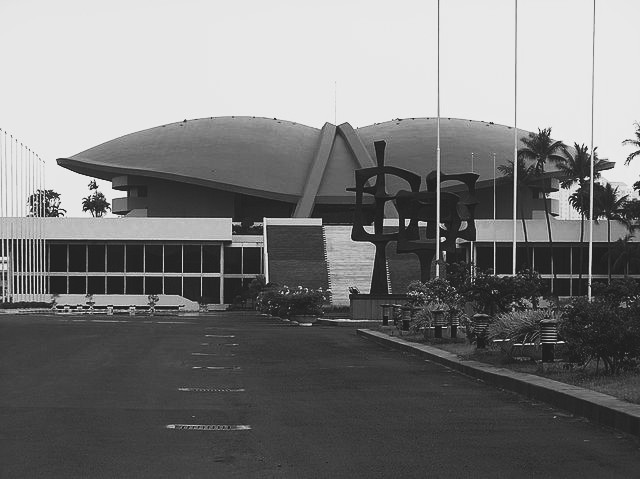

Tan Malaka pada bab ini mengatakan bahwa sejarah pembentukan parlemen, terutama di Inggris, bukanlah kisah yang damai dan adem ayem seperti yang biasa kita baca di buku pelajaran sekolah. Bayangkan saja, dahulu kala, ketika raja memerintah dengan kekuasaan mutlak, rakyat harus berjuang keras mati-matian untuk mendapatkan pengakuan atas hak-haknya.

Salah satu momen penting yang disebutkan oleh Tan Malaka adalah adanya “Declaration of Right” tadi. Dokumen tersebut semacam janji bahwa setiap raja yang naik tahta harus mengakui undang-undang yang melindungi hak rakyat. Momen inilah yang menjadi titik balik, di mana perlawanan rakyat mulai menghasilkan suara nyata dalam pemerintahan. Pada akhirnya, perlawanan rakyat melawan tirani itu akhirnya membuka jalan bagi pembentukan lembaga yang lebih demokratis.

Pertempuran perjuangan panjang antara raja dan rakyat menyempurnakan lembaga parlemen. Peristiwa-peristiwa seperti konflik di Inggris dan tak luput di Jerman juga pun menunjukkan bahwa pembentukan parlemen adalah hasil dari pergolakan, bukan sekedar reformasi damai.

Di setiap undang-undang yang kita kenal sekarang, terdapat cerita pahit tentang perlawanan dan pengorbanan dibalilknya.

Secara teorinya, parlemen itu seharusnya menjadi perwujudan kedaulatan rakyat, menjadi cermin kehendak rakyat. Namun, nyatanya dalam praktiknya struktur ini sudah dipenuhi oleh birokrasi dan kepentingan kapitalis. Hal ini terlihat dari bagaimana undang-undang dan kebijakan dihasilkan berdasarkan perhitungan politik praktis, bukan semata-mata aspirasi masyarakat.

Disini Tan Malaka menyoroti bagaimana struktur birokrasi dan kepentingan modal telah merusak fungsi dari parlemen. Perjuangan rakyat yang dulu mengguncang kerajaan dengan protes dan pemberontakan, perlahan pun digantikan oleh politik praktis yang lebih mementingkan perhitungan angka dan kepentingan segelintir elit kapitalis. Seolah-olah semangat perlawanan itu terkubur di balik dinding-dinding lembaga yang sudah terlalu birokratis.

Meski lembaga parlemen telah berevolusi sekalipun, kita harus tetap kritis dan selalu bertanya-tanya,

“Apakah ini benar-benar sudah mewakili keinginan rakyat?”

Sejarah seharusnya mengajarkan kepada kita bahwa setiap perubahan besar selalu dimulai dari perlawanan rakyat. Semangat para pejuang zaman dahulu harus menjadi bahan bakar bagi kita untuk terus menuntut keadilan di zaman sekarang.

### BAB III: Dari Negeri Belanda ke Benua Asia

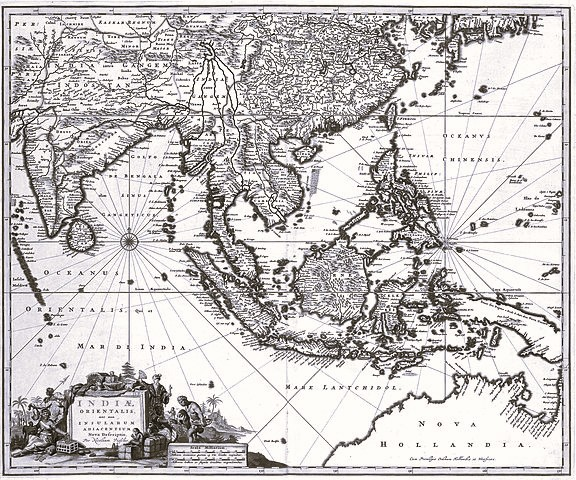

Dalam bagian ini, Tan Malaka membuka wacana dengan membandingkan sistem pemerintahan di beberapa negara, khususnya antara Belanda, Jepang, dan Hindia (Indonesia masa penjajahan).

Ada dua pasal utama yang perlu kita soroti:

#### Di Negeri Belanda

Di Belanda, meskipun raja tetap memiliki peran simbolis, kekuasaan sebenarnya telah bergeser ke tangan parlemen dan kabinet. Perubahan besar terjadi pasca peristiwa pergolakan, terutama pada tahun 1849, di mana kerusuhan dan perlawanan rakyat memaksa raja untuk mengakui konstitusi baru. Konstitusi tersebut menempatkan kekuasaan pemerintahan pada menteri-menteri yang bertanggung jawab dan terikat pada parlemen, bukan lagi semata-mata atas perintah raja.

Sebelum perubahan, menteri hanya merupakan alat raja dan tidak bertanggung jawab secara langsung. Setelah reformasi, menteri harus menanggung akibat kebijakan mereka, karena mereka dipilih dari jajaran parlemen yang merepresentasikan rakyat. Hal ini menandakan bahwa kekuasaan pemerintahan seharusnya merupakan perwujudan kehendak rakyat, meskipun dalam praktiknya terdapat banyak ironi dan kompromi antara ekspektasi dan kenyataannya.

Pada awalnya, hak memilih di Belanda sangat terbatas dan hanya diberikan kepada mereka yang mampu membayar pajak, sehingga hanya kelompok elit yang terwakili.

Dorongan kaum sosialis kemudian memaksa pemerintah untuk melebarkan hak pilih, sehingga secara bertahap setiap warga yang memenuhi syarat dapat ikut menentukan arah pemerintahan melalui pemilihan wakil parlemen.

Dari sini kita bisa belajar, bahwa suara-suara rakyat agar bisa tersampaikan kepada pemerintahan, yang mewakili harus benar-benar dari kaum yang meminta diwakilkan, bukan wakil hasil pesanan dari kalangan elit.

#### Jepang dan Hindia

##### Jepang

Pemilihan wakil di Jepang tidak sepenuhnya mengakomodasi keinginan rakyat. Justru, pemilihan itu sangat dipengaruhi oleh kelompok Hartawan dan ningrat, sehingga suara rakyat kecil tetap terabaikan.

Bisa dikatakan, sistem parlemen di Jepang pada saat itu hanyalah model tiruan dari Barat yang sama-sama didominasi oleh kepentingan Elit.

Dalam struktur pemerintahan Jepang, lembaga seperti “Huis der Lords” (semacam Majelis Tinggi di tanah Inggris. Tempat bersemayamnya kanjeng-kanjeng dan ningrat-ningrat. Tetapi di Jepang lebih besar kuasanya daripada di tanah Inggris), serta peran Genro (tokoh senior) menunjukkan bahwa kekuasaan masih terkonsentrasi pada segelintir elit. Hal ini mengindikasikan bahwa meskipun secara formal terdapat parlemen, realitanya, keputusan penting masih ditentukan oleh kelompok-kelompok yang berkuasa.

##### Hindia

Di Hindia, pemerintahan dijalankan dengan merujuk pada model yang di Belanda. Meskipun terdapat lembaga seperti Dewan Rakyat yang bernama Volksraad, kekuasaan nyatanya masih berada di tangan menteri jajahan yang bertanggung jawab kepada Parlemen di Belanda.

Dikarenakan sistem ini dirancang hanya untuk kepentingan pemerintahan kolonial, peran rakyat dalam menentukan arah kebijakan hanya bersifat formalitas saja. Meskipun struktur sudah ada, rakyat tidak mendapatkan pengaruh nyata dalam pembuatan keputusan politik di Hindia pada saat itu.

### BAB IV: Kritik (Celaan) atas Parlemen

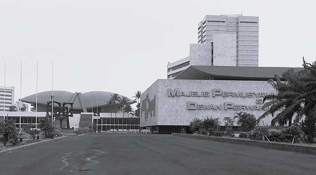

#### Jejak Sejarah: Latar Belakang Kapitalisme dan Sosialisme

Bagian ini adalah salah satu segmen terpenting yang harus benar-benar dibahas secara cermat. Sebelum Tan Malaka menyampaikan kritik tajamnya, pada bab kali ini, ia akan membawa kita terlebih dahulu menyusuri lorong waktu ke abad ke-19 di Eropa.

Bayangkan, pada masa itu, masyarakat agraris yang damai tiba-tiba diguncang oleh revolusi industri. Mesin-mesin mulai menggantikan tenaga manusia, dan ribuan petani kehilangan lahan serta mata pencaharian mereka. Peristiwa inilah yang melahirkan urbanisasi besar-besaran, dimana jutaan orang terpaksa merantau ke kota untuk mencari nafkah di pabrik-pabrik.

Dari transformasi tersebut, lahirlah kelas pekerja atau proletariat, yang nasibnya diatur oleh sistem kapitalis.

Kapitalisme menurut Tan Malaka bukan hanya soal akumulasi uang semata. Ia mengendalikan kebutuhan dasar manusia, mengubah adat istiadat, bahkan merambah ke urusan kenegaraan.

Ketika para pemilik modal terus mengejar keuntungan dengan cara menekan upah, muncullah gerakan sosial dan ideologi sosialisme sebagai respons atas ketidakadilan yang semakin merajalela.

Tokoh-tokoh perjuangan dan pemikir dari aliran Marxis, yang hari ini inspirasinya mengalir deras dalam setiap hela napas perjuangan kaum proletariat, menjadi saksi bisu bahwa perubahan tidak akan pernah datang dengan sendirinya.

Inilah latar belakang historis yang kemudian menjadi fondasi kritik Tan Malaka terhadap sistem parlemen.

#### Inti Kritik Tan Malaka terhadap Parlemen

Meskipun secara retorika parlemen dianggap sebagai wujud kedaulatan rakyat, kenyataannya lembaga ini telah diracuni oleh kepentingan kapitalis. Kebijakan yang dihasilkan lebih banyak menguntungkan segelintir pemilik modal daripada mewujudkan keadilan sosial bagi kaum pekerja yang telah dirugikan oleh sistem industri.

Para wakil di parlemen, yang seharusnya menjadi cermin aspirasi rakyat, kerap kali berasal dari kalangan elit. Mereka yang duduk di ruang-ruang parlemen tak lagi mewakili suara rakyat yang terpinggirkan, melainkan lebih berfungsi sebagai alat untuk mempertahankan status quo yang menguntungkan kelompok tertentu.

Dalam sistem parlementer, proses pembuatan undang-undang sering kali terseret kedalam perhitungan politik praktis dan kompromi yang menghambat terwujudnya perubahan sosial yang nyata. Keterbatasan tersebut membuat upaya pemberdayaan rakyat untuk mencapai keadilan justru menjadi tersendat di tengah birokrasi dan kepentingan politik yang kaku.

Menurut Tan Malaka, tanpa mengubah struktur yang berakar pada sistem kapitalis, parlemen tidak akan pernah mampu menjadi alat efektif untuk mewujudkan kesejahteraan dan keadilan sosial bagi semua lapisan masyarakat.

Kritiknya mengajak kita untuk menyadari bahwa retorika “suara rakyat” hanyalah "omon-omon" bayangan jika tidak didukung oleh perwakilan yang benar-benar mewakili kepentingan kaum pekerja.

### BAB V: Bisakah Parlemen Itu Dipakai Untuk Mendatangkan Cita-cita Sosialisme?

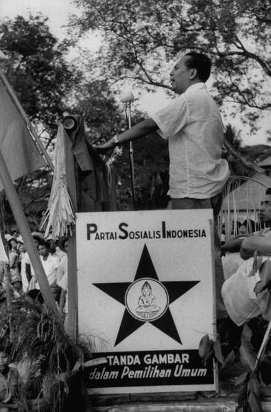

Di bab ini, Tan Malaka seolah-olah mengajukan pertanyaan mendasar: apakah melalui parlemen, cita-cita sosialisme, yakni keadilan dan kesejahteraan bagi rakyat—bisa terwujud?

Namun, sebelum sampai ke intinya, ia mengingatkan kita pada peristiwa-peristiwa bersejarah dan konflik nyata antara kaum Buruh dan kaum Modal di Eropa yang mewarnai zaman kapitalisme.

#### Latar Belakang Sejarah dan Konflik Kelas

Bahwa pada masa itu, pertentangan antara kaum Buruh dan kaum Modal di Eropa sudah mencapai titik puncak. Tak hanya bertentangan secara ide, mereka sudah sampai saling bermusuhan dan bahkan berperang.

Walaupun serangan kaum Buruh sangat dahsyat, kaum Modal mampu menahan dengan bantuan aparat negara. Parlemen yang berhubungan erat dengan militer, justisi, dan polisi.

Di sinilah terbukti bahwa dalam sistem negara kapitalis, kekuasaan sejati berada di tangan kaum Modal.

Menurut Tan Malaka, negara pada zaman itu diciptakan oleh kaum Modal sebagai alat untuk menguasai rakyat. Dalam sistem ini, segala sesuatu, mulai dari pejabat negara, justisi, hingga rumah tahanan dibentuk untuk menjaga kekuasaan segelintir orang, bukan untuk melayani kepentingan bersama.

Seiring berjalannya waktu, semakin kaya kaum Modal, semakin terpinggirkan dan miskinnya kaum Buruh.

Yang kaya makin kaya, yang miskin makin miskin.

Inilah gambaran nyata dari konflik antara kapital (modal) dan upah yang tak pernah mensejahterakan, sebagaimana yang pernah dikemukakan oleh Karl Marx.

#### Jalan Menuju Sosialisme: Dua Pendekatan

Untuk menjawab apakah parlemen dapat digunakan untuk mendatangkan sosialisme, Tan Malaka mengemukakan dua jalan taktik yang muncul dari perdebatan di kalangan kaum sosialis:

1. <b>Haluan Revolusioner (Mendidik Rakyat)</b>: Di sini, jalan yang ditempuh adalah mendidik rakyat agar mampu mengatur negeri secara cepat. Pendekatan revolusioner menekankan bahwa rakyat harus bangkit dan mengambil alih kekuasaan secara langsung, tanpa melalui struktur negara yang sudah terkontaminasi oleh kepentingan Modal.

2. <b>Haluan Evolusi (Merebut Kursi di Parlemen)</b>: Alternatif lainnya adalah melalui jalur politik, yakni merebut kursi di parlemen sehingga kaum Buruh bisa "menang suara" dan mempengaruhi kebijakan. Pendekatan ini dibawa oleh partai-partai sosialis, seperti Partai Sosial Demokrat dan Partai Komunis.

#### Persaingan dan Pertentangan di Kalangan Sosialis

Dalam perdebatan tentang strategi mencapai sosialisme, muncul perbedaan pandangan antara dua kubu utama:

- Kaum Sosial Demokrat: Tokoh-tokoh seperti Karl Kautsky berpendapat bahwa jika kaum Buruh berhasil meraih mayoritas kursi di parlemen, mereka dapat mengalahkan pengaruh kaum Modal. Mereka percaya bahwa dengan mengalihkan hak milik pribadi (particulier bezit) ke hak bersama, semua aset produksi seperti pabrik, tambang, dan lahan akan dikelola oleh rakyat.

- Kaum Komunis (Bolshevik): Di sisi lain, Lenin dan Trotsky meyakini bahwa parlemen yang terikat pada birokrasi, militer, polisi, dan bank, yang merupakan benteng kekuasaan kaum Modal tidak mampu mengangkat keperluan rakyat. Bagi Lenin, sistem itu sudah terlanjur menjadi alat penjagaan kepentingan segelintir elit, sehingga upaya perubahan melalui jalur parlementer hanyalah ilusi belaka.

#### Kondisi Nyata di Eropa

- Jerman: Meski di negara ini sudah ada parlemen, kenyataannya belum ada kemenangan signifikan bagi kaum Buruh. Presiden Ebert yang semula menjadi simbol perlawanan justru hanya menjadi “bendera merah” di atas benteng kekuasaan uang. Pabrik, tambang, dan lahan tetap dikuasai oleh segelintir orang, sementara sistem perbankan dan pendidikan masih didominasi oleh kaum Modal.

- Kebangkitan Kembali Sistem Monarki Jerman: Ada upaya untuk mengembalikan kekuasaan kaisar seperti pada masa Wilhelm II, menunjukkan bahwa kekuasaan parlemen tidak mampu menghentikan gelombang konservatisme dan dominasi elit.

- Pertentangan Internal Kaum Sosialis: Perselisihan antara Partai Sosial Demokrat dan Partai Komunis di Jerman menambah kompleksitas perjuangan. Kaum Komunis, yang dipimpin oleh tokoh-tokoh seperti Liebknecht dan Rosa Luxemburg, enggan ikut campur dalam sistem parlemen yang dikuasai kaum Modal dan militer, sehingga terjadi perpecahan yang pada akhirnya melemahkan kekuatan buruh.

Dari seluruh peristiwa dan perdebatan tersebut, Tan Malaka menyimpulkan bahwa Parlemen yang berakar pada sistem negara kapitalis dengan segala birokrasi dan institusi pendukungnya tidak mungkin digunakan untuk mendatangkan cita-cita dari sosialisme.

Dengan tegas ia menyatakan:

> Sebaliknya pula haruslah kaum Buruh sendiri bikin organisasi, kelak kalau saatnya datang, sanggup mengatur pemerintah, hasil negeri, pengadilan dan pendidikan. Buanglah sama sekali pengharapan, yang disangkakan datang dari sesuatu Parlemen!!

### BAB VI: Soviet

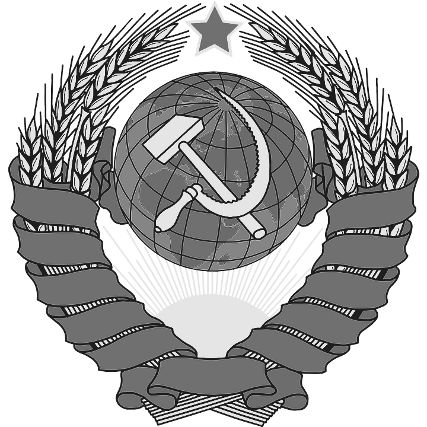

#### Mengakui Zaman yang Masih Kapitalis

Tan Malaka mengingatkan dengan tegas bahwa kita masih hidup dalam zaman kapitalisme. Ia menolak anggapan bahwa sosialisme bisa tiba-tiba hadir setelah semua lembaga negara yang berkuasa runtuh. Seperti kita belajar bahwa sifat manusia, baik yang baik maupun yang buruk, tidak bisa hilang seketika, begitu pula sistem politik harus melalui tahap-tahap perkembangan, layaknya seorang anak yang tumbuh dari masa kanak-kanak menuju dewasa dan akhirnya memasuki usia senja.

Tan Malaka membagi perjalanan kaum komunis dalam tiga tingkat, sebagai upaya untuk menggeser sistem kapitalisme yang telah mengikat nasib proletariat.

##### Tingkat Pertama: Masih Berdiri dalam Kapitalisme

Pada tingkat ini, kaum buruh harus menyadari bahwa mereka masih hidup dalam bayang-bayang kapitalisme.

<!-- - <b>Persenjataan Utama</b>: -->

  Dua senjata utama yang harus dimiliki adalah serikat buruh dan organisasi politik yang murni berasal dari buruh.

  - Serikat Buruh:

      Di sinilah buruh mengangkat senjata ekonomi mereka. Namun, jika serikat ini dicampuri oleh politik kaum Sosial Demokrat yang masih terikat dengan kaum Modal, maka cita-cita pembebasan buruh takkan pernah terwujud.

  - Organisasi Politik:

      Buruh harus memiliki politiknya sendiri, yang tidak menaruh kepercayaan kepada sistem negara kapitalis.

<!-- - <b>Pengalaman di Lapangan</b>: -->

  Dalam praktiknya, pemimpin-pemimpin buruh yang semula berasal dari barisan Sosial Demokrat cenderung menarik dan menakuti hati anggota serikat, sehingga perjuangan buruh hanya berakhir dengan kenaikan gaji sepele dan harga barang yang terus naik. Tan Malaka menekankan bahwa serikat buruh harus senantiasa mengusung cita-cita yang lebih tinggi daripada sekedar uang, yakni politik komunisme yang menolak sistem kapitalisme.

##### Tingkat Kedua: Diktatornya Kaum Proletar

Pada tahap ini, sudah tiba saatnya kaum buruh untuk melangkah menuju zaman komunisme dengan membantah sifat-sifat kemodalan.

<!-- - <b>Pembentukan Lembaga Baru</b>: -->

  Buruh harus menciptakan lembaga-lembaga dan undang-undang yang bertentangan dengan peraturan kapitalisme.

  - Contohnya Revolusi Rusia:

      Di tanah Rusia, kekacauan pasca peperangan besar tahun 1914 dimana kaisar tak mampu meneruskan perang karena kelaparan dan kekurangan senjata menjadi titik balik. Kaum Bolshevik, di bawah pimpinan tokoh seperti Lenin, bangkit untuk mengatur ekonomi negeri melalui komite-komite buruh yang mengambil alih pabrik, tambang, dan lahan.

  - Peraturan Ekonomi dan Politik:

      Di setiap pabrik atau tambang, komite buruh mulai menggantikan majikan. Mereka tak lagi bekerja untuk keuntungan segelintir kapitalis, melainkan untuk kesejahteraan rakyat yang bekerja.

<!-- - <b>Pengaruh Bank dan Sabotase</b>: -->

  Selain daripada itu, Tan Malaka juga menyoroti betapa besar pengaruh Bank dalam sistem kapitalis. Bank-bank yang meminjamkan uang kepada pabrik dan perusahaan kebun menjadi alat untuk mengikat hasil produksi agar tetap menguntungkan kaum Modal. Oleh karena itu, dalam tahap ini, bank seharusnya diubah menjadi Bank Rakyat, yang uangnya dipergunakan untuk keperluan bersama.

##### Tingkat Ketiga: Zaman Komunisme atau Sosialisme Sejati

Tahap akhir adalah ketika semua lembaga ekonomi, pendidikan, pengadilan telah sepenuhnya diatur oleh rakyat, dan setiap orang bekerja sekuat tenaga dengan mendapat hasil yang secukupnya.

- <b>Prinsip Utama</b>:

  Prinsip "Satu untuk semua, dan semua untuk satu" menjadi semboyan utama.

  - Dalam Pendidikan dan Pekerjaan harus mengajarkan nilai kerja keras dan kerja tangan, sehingga tidak ada lagi jurang pemisah antara kaum buruh dan kaum elit.

  - Setiap hasil produksi (pembagian hasil), baik di pabrik, tambang, maupun pertanian harus didistribusikan secara adil.

- <b>Dewan Ekonomi dan Kontrol Terpadu</b>:

  Untuk menghindari ketidakseimbangan produksi, dibentuklah Dewan Ekonomi yang beranggotakan wakil dari semua sektor, baik buruh maupun petani, untuk menentukan kebijakan ekonomi yang menyeluruh.

- <b>Akhir dari Birokrasi Kapitalis</b>:

  Dengan terselenggaranya lembaga-lembaga Soviet, maka kekuasaan birokrasi yang selama ini melayani kepentingan kapitalis akan hilang. Ini adalah tonggak menuju masyarakat yang benar-benar adil, di mana setiap orang mendapatkan hasil kerja sesuai dengan daya upayanya.

#### Sistem Soviet dalam Kehidupan Sehari-hari

Tan Malaka memberikan gambaran konkret tentang bagaimana sistem Soviet bisa diimplementasikan:

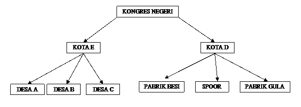

- <b>Di Desa dan Kota</b>:

  Setiap desa harus mengadakan Soviet sendiri, di mana pak tani dan buruh memilih wakil melalui hak pilihan yang luas. Wakil-wakil desa ini kemudian berkumpul di kongres di kota untuk membahas pertukaran hasil. Misalnya, kelebihan gandum dari desa ditukarkan dengan barang-barang industri dari kota.

- <b>Kongres Nasional</b>:

  Di ibu kota, wakil-wakil dari berbagai kota berkumpul dalam kongres nasional. Di sinilah keputusan strategis, mulai dari kebijakan ekonomi hingga pengaturan upah, diambil secara kolektif.

- <b>Pengadilan Rakyat dan Pendidikan</b>:

  Sistem pengadilan pun diubah, sehingga hakim tidak lagi merupakan produk kemodalan, melainkan diambil dari rakyat yang memahami keadilan bersama. Pendidikan juga direformasi untuk mengajarkan nilai kerja nyata, mengintegrasikan kerja otak dan tangan, serta menanamkan semangat persatuan.

Pesan Tan Malaka sangat jelas. Parlemen yang ada saat ini hanyalah cerminan kekuasaan kapitalis. Untuk mendatangkan sosialisme sejati, rakyat harus membangun sistem Soviet yang benar-benar mewakili kekuatan dan aspirasi mereka. Perjuangan itu haruslah dimulai dari dasar, dengan membangun lembaga-lembaga yang tidak terkontaminasi oleh kepentingan modal, dan menolak segala bentuk birokrasi yang mengekalkan ketidakadilan.

### BAB VII: Penghabisan

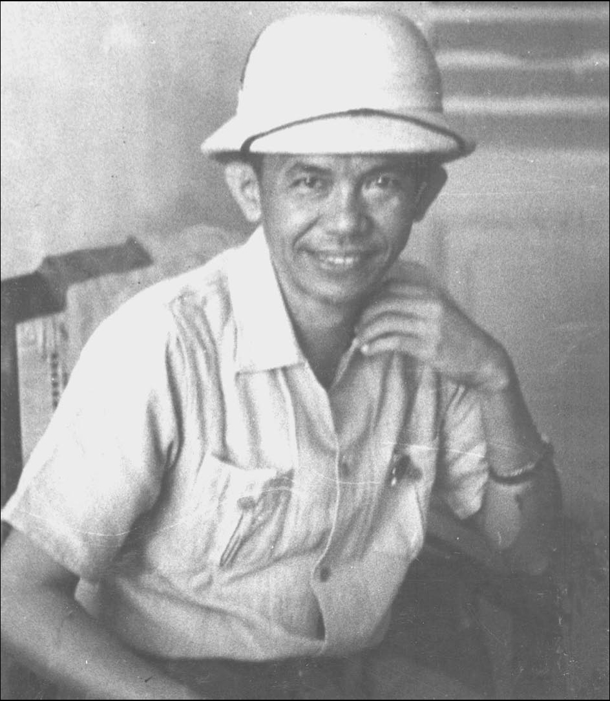

Isi dari bab ini menjadi pembahasan yang lebih panjang dari bab-bab sebelumnya. Karena pada bab inilah klimaks dari buku tersebut dibubuhkan.

Tan Malaka membuka bab ini dengan menegaskan bahwa suatu saat, Hindia akan memiliki kesempatan untuk mengatur negerinya sendiri.

Pilihannya,

Apakah kita tetap memakai sistem Parlementer (kapitalisme) ataukah beralih ke Soviet (komunisme)?

Bagi Tan Malaka, tidak ada keraguan, parlementerisme yang lahir dari kapitalisme hanya akan mengekalkan kesengsaraan kaum buruh, sementara sistem Soviet seperti di Rusia mampu menjadi jalan menuju keadilan sosial.

Namun, perlawanan terhadap kapitalisme tidaklah mudah. Di Eropa, sistem kapitalisme sudah merasuk kuat, ditopang oleh imperialisme yang setiap saat bisa meletuskan perang. Meski begitu, sejarah menunjukkan bahwa kebenaran yang diperjuangkan dengan gigih pada akhirnya akan bangkit juga, berapa pun halangan yang menghadang.

Tan Malaka mencontohkan bagaimana kaum Bolshevik di Rusia pernah ditekan habis-habisan oleh Tsar, tetapi justru berhasil mengambil alih kekuasaan.

Kisah para nabi, seperti Nabi Muhammad SAW yang sempat mengalami masa sulit 10 tahun sebelum hijrah ke Madinah, menjadi bukti lain bahwa ide-ide besar sering kali berawal dari keadaan tertindas.

#### Peristiwa Sejarah: Monarki, Revolusi, dan Kapitalisme

Tan Malaka menyebutkan beberapa contoh revolusioner besar di Eropa:

1. Revolusi Perancis 1789

   Di sinilah monarki mulai tumbang, menandai zaman baru bagi Eropa. Kaum modal (borjuis) yang berhaluan revolusioner bersekutu dengan rakyat untuk mengusir raja-raja.

   Butuh sekitar 60 Tahun dari 1789 hingga 1848, kaum kapitalis mengalami pasang-surut. Kadang menang, kadang raja-raja berhasil bangkit kembali. Baru setelah tahun 1848, monarki benar-benar tumbang dan Parlemen menjadi simbol kekuasaan kaum modal di banyak negara Eropa.

2. Kapitalisme Menguat

   Setelah menumbangkan monarki, kaum modal berkuasa dan memanfaatkan parlemen untuk mempertahankan kepentingannya. Bank, militer, dan birokrasi menjadi pilar yang menopang dominasi mereka.

Tan Malaka menekankan, jika kapitalis saja butuh 60 tahun untuk menaklukkan monarki, mengapa sekarang mereka menuntut kaum Bolshevik yang baru memerintah 2-3 tahun untuk segera “sukses total”? Jelas, ini adalah bentuk politik tipu-muslihat.

#### Parlementerisme (Kekuasaan Rakyat)

Dalam buku ini, Tan Malaka menyertakan diagram yang menjelaskan bagaimana Parlemen (seperti di Belanda) berada di bawah pengaruh kaum modal. Gambaran singkatnya:

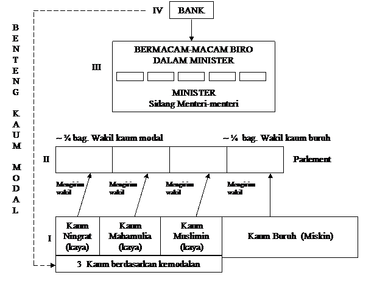

Keterangan:

- Gambar I: Empat Golongan Besar

  1. Kaum Ningrat (Budi Utomo)
  2. Kaum Nasionalis (NIP)
  3. Kaum Muslimin kaya
  4. Kaum Kromo (rakyat jelata, buruh, petani)

- Gambar II: Parlemen

  Masing-masing golongan mengirim wakil ke parlemen. Namun, karena ketiga golongan pertama memiliki kekayaan dan akses ke media serta pendidikan, mereka mampu memengaruhi suara rakyat jelata untuk memilih wakil “pesanan” mereka.

- Gambar III: Sidang Menteri dan Biro-Biro

  Di atas parlemen ada Menteri-menteri yang diisi oleh partai-partai dominan. Birokrasi pun penuh orang-orang yang condong ke kepentingan modal.

- Gambar IV: Bank

  Bank adalah benteng kekuatan kaum modal. Dengan kontrol finansial, mereka bisa menekan parlemen dan menteri, sehingga kebijakan akhirnya tetap menguntungkan kaum modal.

Hasilnya?

Kaum Kromo (rakyat jelata, buruh, petani) tetap tertindas, bahkan meski parlemen sudah diisi oleh wakil bangsa sendiri.

#### Apakah Demokrasi Kapitalis Bisa Diterapkan di Hindia?

Tan Malaka mengungkapkan keraguannya bahwa sistem “republik demokratis” ala Barat (yang sejatinya melayani kepentingan kaum Modal) bisa sukses di Hindia. Bukan hanya karena faktor budaya dan watak masyarakat yang belum mendukung kapitalisme, melainkan juga karena kelemahan fundamental kaum nasionalis kita sendiri—baik itu dari kalangan Budi Utomo, Sarekat Islam, hingga NIP (Nasional Indische Partij). Menurutnya, jika kita membandingkan dengan nasionalisme di Mesir, Hindustan (India), atau Irlandia, gerakan nasionalis kita masih jauh dari berani dan tegas.

1. Mesir dan Hindustan

   Di kedua wilayah ini, gerakan nasionalisme menampilkan sikap lebih radikal dalam menentang kolonialisme. Di Mesir, semangat nasionalisme bangkit akibat campur tangan Inggris yang begitu kuat, termasuk dalam urusan Terusan Suez.

   Di Hindustan (India), sosok seperti Mahatma Gandhi, meskipun menggunakan pendekatan non-kekerasan, benar-benar mengguncang fondasi kekuasaan Inggris.

   Bandingkan dengan Hindia, menurut Tan Malaka, pemimpin-pemimpin kita (kecuali segelintir yang benar-benar konsisten) kerap gamang dan kurang berani mendobrak tatanan, sehingga sulit bagi gerakan nasionalis di sini untuk benar-benar merombak sistem kolonial kapitalis.

2. Irlandia

   Tan Malaka juga menyinggung bagaimana gerakan nasionalis di Irlandia melakukan perlawanan sengit terhadap Inggris. Mereka menunjukkan ketetapan hati yang tinggi dan keberanian dalam perjuangan, sehingga kemerdekaan Irlandia akhirnya tercapai (meski masih menyisakan berbagai persoalan internal).

#### Partai-Partai di Hindia dan Tantangan Modal Asing

Tan Malaka menyoroti beberapa gerakan di Hindia:

- Budi Utomo (Kaum Ningrat)

  Masih kuat dipengaruhi semangat kasta, warisan kebudayaan Hindu-Buddha dan feodalisme Jawa. Rakyat kromo tetap menempatkan kaum bangsawan di posisi tinggi.

- NIP (Nasionalisme Murni)

  Hanya menentang “penjajahan Belanda” secara kebangsaan, tetapi lupa bahwa modal dari bangsa mana pun (Amerika, Inggris, Jepang) tetap bisa menjajah ekonomi Hindia.

- Sarekat Islam (Kaum Muslimin)

  Berawal dari semangat dagang untuk menyaingi toko-toko asing, kemudian berkembang jadi gerakan politik. Namun, di dalamnya sendiri terdapat kaum saudagar dan kaum buruh. Pada saat “harus memerintah sendiri”, bisa saja kaum saudagar menjadi “kapitalis lokal” yang menindas buruh.

#### Pan-Islamisme: Sejarah, Perselisihan, dan Realita Politik

Tak lupa, Tan Malaka juga mengulas gerakan dari Pan-Islamisme yaitu gagasan untuk mempersatukan seluruh kaum Muslimin di bawah satu payung khalifah. Ia menyoroti beberapa peristiwa besar dalam sejarah dunia Islam:

1. Konflik Khalifah Pasca Wafat Nabi Muhammad SAW

   - Empat Khalifah Pertama (Abu Bakar, Umar, Usman, Ali) menjalankan pemerintahan yang relatif adil. Namun, setelahnya, muncul pertanyaan krusial: siapakah yang paling berhak menggantikan Nabi?

   - Pertikaian Ali vs. Bani Umayyah: Sekitar 100 tahun setelah Nabi wafat, terjadi pemberontakan besar di mana keturunan Bani Umayyah hampir habis dibunuh oleh pendukung Ali. Sisa keturunan Umayyah lari ke Spanyol, mendirikan khalifah tandingan yang menentang Khalifah di Bagdad.

   Peristiwa ini menunjukkan betapa sejak awal, dunia Islam sudah diwarnai perpecahan internal, bahkan dalam urusan kepemimpinan tertinggi.

2. Perang Dunia I (1914-1918) dan Runtuhnya Kekhalifahan Utsmaniyah (Turki)

   - Turki dan Jerman: Pada PD I, Jerman mendorong Turki mengibarkan bendera jihad untuk memerangi “kaum kafir” (Sekutu). Namun, faktanya, kaum Muslimin di Hindustan justru berpihak pada Inggris. Begitu pula Muslim di wilayah lain yang terjajah oleh Perancis atau Rusia.

   - Kekalahan Turki: Pasca perang, wilayah-wilayah seperti Arab, Mesopotamia (Irak), Suriah, Mesir, dan sebagian besar Turki Eropa lepas dari kekuasaan Kesultanan Utsmaniyah. Artinya, hanya 5% populasi Muslim yang benar-benar merdeka.

   - Munculnya “Young Turks”: Sejak 1908, pemuda-pemuda Turki berusaha menerapkan parlemen ala Barat. Sultan dibatasi konstitusi. Anwar dan Talaat Pasha memimpin upaya mengganti sistem monarki Islam dengan model parlementer Eropa. Sayangnya, Perang Dunia I mempercepat keruntuhan Utsmaniyah.

Dari sini, Tan Malaka menyimpulkan bahwa Pan-Islamisme gagal karena dunia Muslim sudah terpecah belah, tertinggal secara industri dan teknologi, serta masih dikepung oleh imperium-imperium kapitalis. Meskipun di atas kertas, kaum Muslimin mungkin bisa bersatu dalam hal agama, tetapi realitas politik dan ekonomi telah memecah mereka ke dalam kepentingan masing-masing.

##### Sejauh Mana Harapan Persatuan Islam?

Tan Malaka menegaskan: jika 200–300 juta Muslim (yang mayoritas hidup dalam kemiskinan, minim pendidikan, dan tak punya senjata) hendak bersatu secara politik, mereka harus melawan modal global. Padahal, kaum buruh sedunia saja masih kesulitan menumbangkan kapitalisme. Karena itu, ia berpendapat bahwa meski persatuan dalam hal iman mungkin terus terjaga, persatuan politik untuk membentuk satu “Darul Salam” di bawah khalifah sangat sulit diwujudkan.

##### Implikasi Bagi Sarekat Islam di Hindia

Menyambung soal Pan-Islamisme, Tan Malaka membahas mengenai organisasi Sarekat Islam (SI) di Hindia. Pada mulanya, SI memang tumbuh dari semangat berdagang, menyaingi toko-toko asing. Namun, di dalamnya bercampur kaum saudagar (yang cenderung jadi kapitalis lokal) dan kaum buruh (proletar). Jika suatu hari SI memegang pemerintahan, benturan kepentingan antara “kaum tengah” (saudagar) dan “kaum miskin” (buruh) niscaya muncul.

Tan Malaka yakin bahwa kaum buruh yang jumlahnya lebih banyak dan paling tertindas—pada akhirnya akan mencari jalan menuju komunisme. Meskipun mungkin SI akan mengalami pasang-surut, kaum proletar-lah yang lebih berpeluang memenangkan hati rakyat banyak.

Tan Malaka menutup penjelasannya dengan menyatakan bahwa, dalam sejarah, ada tiga corak pemerintahan:

1. Zaman Kuno (Monarki/Feodalisme)

   Ekonomi agraris, alat produksi sederhana. Pemerintahan dipegang oleh raja dan kaum bangsawan.

2. Zaman Kapitalisme (Parlementerisme)

   Ditandai Revolusi Perancis 1789, munculnya mesin-mesin, pabrik, dan industri. Kekuasaan ada di tangan parlemen, tetapi dikendalikan oleh modal.

3. Zaman Transisi Menuju Sosialisme (Soviet)

   Inilah masa di mana kaum buruh mengambil alih alat produksi dan membentuk lembaga-lembaga sendiri, seperti Soviet, untuk menggantikan parlemen. Dari sinilah jalan menuju komunisme sejati akan terbuka.

#### Menjalani Sejarah Hindia 300 Tahun Terakhir dengan “Langkah Raksasa”

1. <b>Era VOC (1600–1800): Monopoli, Hongi, dan Pemberontakan</b>

   Tan Malaka memulai kisah dengan menyoroti kedatangan kaum Modal Belanda sekitar tahun 1600-an. Saat itu, harga rempah-rempah (pala, cengkeh) di Eropa melambung tinggi, membuat VOC (Vereenigde Oost-Indische Compagnie) nekat berlayar jauh, meski menghadapi lautan es di kutub utara dan ancaman Spanyol. Begitu mereka sampai di Hindia:

   1. Monopoli Perdagangan

      VOC memaksa rakyat hanya menjual cengkeh dan pala pada mereka dengan harga murah. Pulau Ambon dipaksa menanam cengkeh saja, sedangkan Pulau Banda harus menanam pala. Pulau lain yang menanam rempah harus dihancurkan kebunnya agar harga tetap tinggi.

   2. Hongi Tochten (Ekspedisi Hongi)

      Ekspedisi inilah yang dilakukan VOC untuk membumihanguskan tanaman cengkeh dan pala di pulau-pulau lain di luar Ambon dan Banda. Akibatnya, banyak rakyat kehilangan mata pencaharian dan mengungsi. Banyak pulau pun menjadi kosong, ditinggalkan penduduknya.

   3. Pemberontakan Tulu Kabessi

      Di Ambon, salah satu pahlawan lokal yang menentang monopoli VOC adalah Tulu Kabessi. Ia lama bertahan di bentengnya, namun akhirnya kalah karena VOC menyusup pada malam hari. Tulu Kabessi yang menyerahkan diri secara ksatria untuk membebaskan para kepala-kepala yang dituduh memberontak, malah dipancung oleh Gubernur Demmer. Peristiwa ini menjadi simbol betapa kejamnya kebijakan VOC.

   Selama kira-kira 200 tahun, VOC berkuasa dan mengeruk keuntungan luar biasa. Namun, ongkos peperangan, benteng, dan serdadu yang mahal membuat VOC akhirnya bangkrut. Pada 1800-an, Pemerintah Belanda mengambil alih Hindia.

2. <b>Era Daendels dan Sistem Tanam Paksa</b>

   1. Gubernur Jenderal Daendels

      Segera setelah VOC dibubarkan, muncullah kebijakan Daendels (1808–1811) yang terkenal dengan proyek Jalan Raya Anyer–Panarukan. Rakyat dipaksa kerja rodi membangun jalan yang memudahkan perpindahan serdadu. Ribuan orang mati karena kelelahan, penyakit, dan minimnya perlindungan.

   2. Cultuurstelsel (Tanam Paksa) oleh Van den Bosch (1830-an)

      - Kopi, Gula, dsb.

        Petani dipaksa menanam komoditas bernilai tinggi di Eropa. Tan Malaka menyebut kebijakan ini sebagai puncak hisapan dan penindasan. Keringat dan darah rakyat digunakan untuk menumpuk kekayaan bagi Pemerintah Belanda.

      - Keuntungan Luar Biasa

        Dari hasil tanam paksa, Belanda membayar hutang-hutangnya dan membangun spoor (rel kereta) di negerinya.

        Bagi Hindia?

        Lagi-lagi nihil. Penderitaan rakyat semakin parah.

3. <b>Tahun 1875: Era Konsesi dan Politik Etis</b>

   1. Hukum Sewa Tanah 75 Tahun

      Ketika keuntungan tanam paksa menurun, Belanda mengeluarkan undang-undang yang membolehkan kaum modal Eropa menyewa tanah Hindia hingga 75 tahun. Perkebunan-perkebunan swasta pun tumbuh subur, menggarap tembakau, karet, teh, minyak, dan lain-lain.

   2. Perubahan Pola Penindasan

      - Politik Etis

        Muncul gagasan bahwa Hindia butuh pendidikan. Bukan karena Belanda tiba-tiba “baik hati,” melainkan karena pabrik gula, tambang, dan perkebunan modern memerlukan kuli halus (alias tenaga kerja terampil): juru tulis, mandor, hingga insinyur.

      - Sekolah HIS, MULO, HBS, THS (Technische Hoogeschool)

        Dengan sekolah-sekolah ini, kaum modal bisa mendapatkan tenaga kerja murah dari penduduk lokal yang terpelajar. Tan Malaka menegaskan, inilah bentuk “etika” kapitalisme: agar industri berjalan lancar dan profit tetap besar.

   3. Eksploitasi Berlanjut

      - Perkebunan dan Pertambangan

        Di Sumatera, Kalimantan, Sulawesi, berbagai perusahaan asing mengeksploitasi hasil bumi. Buruh lokal dibayar murah, sementara investor asing meraup keuntungan berlipat.

      - Heerendienst dan Peperangan di Jambi

        Demi memudahkan angkutan minyak tanah, rakyat dipaksa membangun jalan raya tanpa upah. Hal ini memicu perlawanan bersenjata. Seperti halnya Hongi Tochten, peperangan pun menelan korban ribuan orang tak berdosa.

   4. Mesin, Kereta Api, dan Kapal Api: Langkah Raksasa Kapitalisme

      1. Kebutuhan Tenaga Terampil

         Kereta api, kapal uap, dan pabrik modern tidak bisa lagi mengandalkan tenaga kerja yang buta huruf. Di sinilah sekolah-sekolah didirikan lebih banyak. Namun, lulusan sekolah kerap kali menganggur karena industri tak sanggup menampung mereka semua.

      2. Nasib Kaum Buruh

         - Upah Murah, Beban Berat

           Orang Eropa di negerinya butuh pakaian tebal, makanan bergizi, rumah kokoh karena iklim dingin. Di Hindia, kaum buruh hidup dalam kesederhanaan. Jadi, majikan membayar upah lebih rendah.

         - Pergeseran dari Desa ke Kota

           Karena tanah di-erfpacht (disewakan) untuk pabrik gula, petani terdesak dan lari ke kota. Terbentuklah kelompok proletar baru menjadi kuli di perkebunan, tambang, atau perusahaan kereta api.

      3. Keterlibatan Modal Internasional

         Hindia menjadi lahan rebutan modal dari Belanda, Inggris, Amerika, Swiss, hingga Jepang. Misalnya, industri minyak tanah (kini migas) yang bisa memicu konflik antarnegara besar. Kaum modal pun membentuk Liga Bangsa-Bangsa, yang menurut Tan Malaka hanya melanggengkan kolonialisme dan penindasan.

   5. Menuju Kesadaran Kelas: Benih Perlawanan

      Meski terkesan suram, Tan Malaka menegaskan bahwa perkembangan kapitalisme di Hindia, pada akhirnya, akan memunculkan kesadaran baru:

      1. Kaum Terpelajar Lokal yang “Tersisih”

         Tidak semua lulusan sekolah bisa dipekerjakan. Banyak yang menganggur, sementara mereka tak mau lagi kembali jadi petani. Ketika mereka sadar bahwa bangsa sendiri masih tertindas, sebagian akan berbalik melawan sistem kapitalis.

      2. Organisasi Kaum Buruh

         Perkembangan pabrik, tambang, dan perkebunan menciptakan basis proletariat. Semakin sadar akan penindasan, mereka mulai belajar dari gerakan buruh Eropa (terutama setelah Revolusi Rusia 1917). Muncullah serikat-serikat buruh yang kelak bisa bersatu dalam Vakcentrale, organisasi payung kaum buruh.

      3. Harapan Revolusioner

         Seperti halnya di Eropa, aksi menuntut kenaikan upah tidak akan menyelesaikan masalah, karena harga barang akan ikut naik. Solusi tuntas hanya bisa tercapai jika rakyat (buruh dan tani) meruntuhkan sistem kapitalis. Tan Malaka yakin, cepat atau lambat, gejolak di Hindia akan mengarah ke perubahan radikal.

   Disini dapat diambil hikmahnya, bahwa justru melalui perkembangan kapitalisme inilah bibit-bibit kesadaran perlawanan dari rakyat Hindia dapat muncul. Buruh dan tani yang tertindas pada akhirnya akan bersatu, tidak lagi sebatas mengemis kenaikan upah, tetapi memperjuangkan perubahan sistemik. Inilah pangkal optimisme dari Tan Malaka, bahwa pada waktunya, rakyat Hindia akan bangkit dan menemukan jalannya sendiri menuju kebebasan sejati.

#### Jatuhnya Kapitalisme dan Lahirnya Komunisme

Pada bagian ini, Tan Malaka menjelaskan bahwa kapitalisme, dengan sifatnya yang selalu berujung pada persaingan (concurrentie), akhirnya menciptakan mesin-mesin baru yang justru menghasilkan over-produksi. Akibatnya, muncul politik kolonial (rebut-merebut wilayah jajahan) serta perlombaan senjata antarnegara besar. Semuanya dipicu oleh kerakusan kaum Modal (kapitalis).

1. <b>Perang Dunia I (1914–1918)</b>: Badai yang Menghancurkan

   - Aliansi dan Kecurigaan di Eropa: Sebelum meletusnya PD I, Eropa terbagi dalam dua kubu raksasa:

     - Kubu Jerman, Austria-Hongaria, dan Italia (awalnya Italia di sana, tetapi kemudian beralih ke pihak lawan),

     - Kubu Inggris, Rusia, dan Prancis. Keduanya saling mencurigai dan memperkuat militer. Akhirnya, benturan kepentingan politik dan ekonomi meledak menjadi perang paling dahsyat dalam sejarah manusia.

   - Kehancuran Masif

     Jutaan nyawa melayang, kota-kota hancur, dan jutaan lainnya cacat atau kelaparan. Tak satu pun negeri yang benar-benar aman. Menurut Tan Malaka, “wabah penyakit kolera” saja tak sebanding dengan bencana yang diakibatkan kerakusan kapitalisme.

   Namun, dari kehancuran itulah muncul babak baru. Tanah Rusia misalnya, adalah yang pertama kali “sadar.” Kaum buruh Rusia akhirnya menyadari bahwa mereka hanya dijadikan perkakas untuk memuaskan nafsu kaum Modal. Revolusi pun meletus, dan kaum Bolshevik mengambil alih kekuasaan, menandai lahirnya Soviet Rusia (negara komunis pertama).

2. <b>Gejolak Pasca-Perang di Eropa</b>

   Tan Malaka menggambarkan situasi di berbagai negara Eropa setelah PD I:

   - Jerman

     Kalah perang, kehilangan wilayah, kapal, kereta, serta dibebani hutang perang. Kaum buruh resah, kerap melakukan pemogokan dan pemberontakan. Partai Sosial Demokrat (yang pernah dominan) dianggap gagal menyelesaikan krisis. Monarki (kaum kaisar) menguat kembali, tetapi kaum Komunis pun terus menekan. Tan Malaka memprediksi Jerman akhirnya harus memilih: Monarki atau Komunisme.

   - Prancis

     Meskipun keluar sebagai pemenang, Prancis menanggung hutang perang sekitar 300 miliar franc. Wilayah industri di utara hancur, banyak pemuda tewas, dan tentara masih tersebar di daerah pendudukan (Jerman barat) maupun koloni (Syria, dsb.). Kegembiraan nasional pasca-menang perang tidak akan bertahan lama karena ekonomi berantakan. Kaum Komunis di Prancis, yang tumbuh di negeri pelopor Revolusi 1789, semakin kuat.

   - Inggris

     Sebagai kapitalis tertua, Inggris pun diguncang. Pemogokan besar-besaran, biaya perang tinggi, dan kemunculan gerakan kemerdekaan di Mesir, Hindustan (India), dan Irlandia membuat Inggris terancam. Meski masih kuat, “penyakit” kapitalisme lambat laun akan melemahkannya.

   - Italia, Austria-Hongaria, Belgia, Belanda, dan Lain-lain

     Hampir semua mengalami kekacauan ekonomi dan politik. Austria-Hongaria pecah menjadi dua negara, dan keduanya berkonflik. Italia dilanda bentrokan keras antara kaum buruh komunis dan kaum modal. Negeri-negeri netral sekalipun diguncang gerakan buruh yang makin vokal.

   Singkatnya, Eropa yang dulu jadi pusat kapitalisme kian terpuruk. Di mana-mana, gerakan komunis mencuat sebagai alternatif sistem yang menolak penindasan modal.

3. <b>Jepang dan Amerika: Melesat, Tapi Rawan Gejolak</b>

   - Jepang

     Setelah Restorasi Meiji (1868), Jepang melompat dari zaman feodal kuno ke kapitalisme modern. Mereka memanfaatkan teknik Barat untuk membangun industri dan militer. Namun, kekuasaan tetap berada di tangan bangsawan, militer, dan modal. Jepang pun terlibat politik ekspansionis di Syantung, Manchuria, Korea, dan Formosa.

     Walau begitu, rakyat Jepang sendiri kian gelisah. Pemogokan buruh kerap terjadi, dan tuntutan hak pilih universal semakin lantang. Prof Kimura (seorang yang mirip dengan Tan Malaka dari Jepang) misalnya, ditangkap karena menyebarkan ide komunisme. Masa depan Jepang belum pasti, bisa jadi gelombang komunis akan menyeruak di sana.

   - Amerika Serikat

     Disebut “raksasa uang” karena setelah PD I, Amerika menjadi kreditor utama dunia. Industrinya maju pesat, tanahnya luas, dan sumber daya melimpah. Namun, tetap saja, lebih dari 5 juta buruh dipecat (pengangguran) akibat krisis perniagaan. Upah murah dan pemogokan besar menandai ketidakstabilan kapitalisme di sana. Gerakan komunis pun tumbuh, walau banyak pemimpinnya dipenjara.

4. <b>Cina: Kacau Politik, Potensi Komunisme</b>

   Benua Cina berpenduduk sekitar 450 juta jiwa. Sejak lama, negeri ini terpecah antara utara dan selatan, dengan jenderal-jenderal yang sering berkuasa sendiri. Jepang pun menekan Cina dengan mengambil alih Manchuria dan Shantung. Di tengah huru-hara itu, menurut Tan Malaka, Cina bisa jadi kelak memihak komunisme untuk melawan imperialisme Jepang, Inggris, Amerika, dan lainnya.

5. <b>Hindustan (India): “Raksasa Terjajah” Berpenduduk 300 Juta</b>

   Bagi Tan Malaka, Hindustan sangat penting karena:

   1. Populasi 300 Juta: Sekitar 1/5 penduduk dunia, dan dulunya pusat peradaban.

   2. Sejarah Penjajahan Mirip Hindia: Inggris menerapkan politik dagang (OIC), menumbuhkan kelaparan, serta mengadu domba penguasa lokal. Lord Clive, Warren Hastings, hingga Jenderal O’Dyer dikenal kejam.

   3. Gerakan Kemerdekaan: Kini, Hindustan diguncang gerakan nasionalis, agama, dan sosialis. Mahatma Gandhi menjadi simbol perlawanan damai terhadap Inggris. Namun, Tan Malaka yakin jika nanti Hindustan merdeka, rakyatnya yang miskin akan menuntut perubahan mendasar: Kapitalisme atau Komunisme? Gandhi pun tak bisa terus berdiri di tengah, pada akhirnya, ia harus memilih berpihak ke modal lokal atau kaum proletar.

   Tan Malaka berpendapat, jikalau Hindustan lepas, Inggris akan semakin lemah. Bila Inggris runtuh, kapitalisme Eropa ikut goyah, membuka jalan bagi komunisme di seluruh dunia.

6. <b>Dunia yang Semakin Terkait</b>

   Terakhir, Tan Malaka menegaskan bahwa dunia kini saling terhubung. Tidak ada lagi lautan atau gunung yang jadi penghalang. Kapal uap, kereta api, pesawat, dan telegram menjadikan perdagangan dan konflik berskala global. Ia mencontohkannya dengan:

   - Selat Malaka dan Sunda menjadi pintu perdagangan vital antara Cina-Jepang-Amerika dan Eropa-Hindustan.

   - Kemungkinan Perang Baru antara Jepang dan Amerika sedang berlomba memperbesar armada laut. Eropa dan Hindustan dilanda kekacauan politik. Bukan mustahil terjadi perang global lagi, yang menurut Tan Malaka bisa menjadi medan terakhir antara kekuatan kapitalis dan gerakan komunis internasional.

#### Pertarungan Merah vs. Putih: Posisi Strategis Hindia

Jika perang besar berikutnya meletus antara blok “merah” (Eropa–Hindustan) dan blok “putih” (Jepang–Amerika), Hindia akan menjadi rebutan yang penting. Tan Malaka tak sekedar menebak, tetapi melihat kenyataan geografis. Hindia berada di jalur pelayaran strategis, kaya sumber daya, dan berpenduduk jutaan manusia.

Pertanyaan yang muncul:

1. Apakah kita akan tetap pasif, seperti ratusan tahun lalu?

   Sebelum-sebelumnya, rakyat tanah Hindia sering “pasrah” pada gelombang kolonial yang datang silih berganti. Dari VOC, Daendels, sistem tanam paksa, hingga politik etis seperti yang sudah dibahas sebelumnya.

2. Apakah kita akan berserah kepada modal Amerika, Australia, Jepang, atau Inggris, jika perang itu benar-benar pecah?

   Tan Malaka menegaskan, perang modern selalu menargetkan wilayah-wilayah kaya sumber daya. Hindia jelas masuk dalam hitungan.

3. Akankah kita membiarkan rakyat yang berjumlah jutaan tetap melarat, menunggu pertolongan asing?

   Sejarah menunjukkan, setiap kali bangsa asing masuk, yang terjadi adalah eksploitasi, ekspoloitasi dan eksploitasi. Tidak ada kemerdekaan yang datang dari “kebaikan hati” para penjajah.

#### Seruan Tan Malaka kepada Pemuda

Melihat kenyataan tersebut, Tan Malaka mengajak pemuda-pemuda Hindia yang “suci, adil, dan berani” untuk memikirkan jalan keluar. Baginya, kebangkitan rakyat tidak bisa dibiarkan berjalan tanpa arah. Disini Tan Malaka menekankan:

- Keyakinan pada Sistem Soviet

    Menurut Tan Malaka, hanya sistem Soviet tempat rakyat menguasai alat produksi dan membuat keputusan politik secara langsung, yang mampu membebaskan Hindia dari belenggu penindasan ribuan tahun. Ini bukan sekadar teori, melainkan hasil pengamatannya atas Revolusi Rusia (1917) dan gerakan buruh di Eropa.

- Tak Cukup Hanya Berteori

    Jika seseorang sudah paham dan yakin bahwa “Soviet-lah jalan pembebasan,” maka ia harus terjun ke pergerakan rakyat, bukan sekadar menyimpannya sebagai gagasan indah di kepala. Tan Malaka menegur mereka yang hanya pintar bicara, tetapi tak pernah bersentuhan dengan kaum buruh dan tani.

#### Potensi Terpendam: Organisasi Buruh dan Politik

Tan Malaka melihat Hindia sebagai “raksasa yang tertidur,” penuh potensi:

1. Banyaknya Kaum Proletar

    Pabrik, perkebunan, tambang, dan rel kereta api telah melahirkan kelas buruh. Mereka inilah yang menurut Tan Malaka menjadi kunci perubahan, asalkan diberi wadah organisasi yang kokoh.

2. Minimnya Organisasi yang Kuat

    Sejauh ini belum ada serikat buruh atau partai politik yang benar-benar solid, berlandaskan kepentingan rakyat. Namun, Tan Malaka optimis jika dibangun dengan dasar kerakyatan, serikat-serikat buruh dan partai-partai revolusioner bisa menggerakkan jutaan rakyat untuk menuntut keadilan.

3. Lebih Penting dari Universitas

    Tan Malaka bahkan berani bilang, satu “lasykar pergerakan” (serikat atau partai politik) yang kokoh lebih bernilai daripada lima universitas. Sebab, dengan organisasi massa yang kuat, kita bisa menuntut apa pun, termasuk pendirian universitas. Ia menegaskan, kekuasaan rakyat melalui Soviet dapat membangun pendidikan dan pemikiran merdeka, tak hanya di Hindia, tapi juga di seluruh dunia.

#### Menanti Runtuhnya Kapitalisme: Siapkah Kita?

Jika benar kapitalisme di Eropa dan Hindustan akan jatuh sebagaimana diyakini Tan Malaka, maka Hindia harus siap dengan sistem alternatif. Jika tidak, kita hanya akan jatuh ke tangan modal lain yang datang merampas.

Dengan sistem Soviet, Tan Malaka membayangkan rakyat Hindia bisa segera “membubarkan” penindasan dari para kapitalis, menggantinya dengan perdamaian dan keselamatan dunia.

Baginya, persiapan itu tidak bisa menunggu sampai esok. Pemuda harus membangun serikat buruh, perkumpulan politik, dan terus menggembleng diri agar siap menggantikan tatanan usang begitu kapitalisme runtuh.

Tan Malaka tahu bahwa perubahan besar butuh keberanian, bukan sekadar doa. Ia mendesak pemuda untuk tidak takut dicap radikal atau dicurigai penguasa. Karena jika kita pasrah, niscaya Hindia kembali menjadi ajang perebutan modal asing. Sebaliknya, jika kita siap, maka hancurnya kapitalisme justru membuka jalan bagi kemerdekaan sejati.

## Sedikit Rekap dan Penekanan

Tunai sudah pembahasan mengenai buku Parlemen atau Soviet ini. Tulisan kali ini pada intinya mengajak kita untuk menyelami perjalanan pemikiran dari Tan Malaka, melalui salah satu karya tulisnya tersebut.

Dari mulai ulasan mengenai sistem parlemen yang kerap hanya menjadi topeng retorika kedaulatan rakyat, hingga kritik tajam terhadap struktur negara yang pada praktiknya mengukuhkan kekuasaan elit kapitalis semata. Tan Malaka mengungkap bahwa perjuangan sejati tidak pernah berhenti di atas simbol-simbol politik belaka.

Tan Malaka mengajukan alternatif berupa sistem Soviet, sebuah model pemerintahan yang menekankan kekuasaan langsung rakyat melalui organisasi buruh dan partisipasi aktif dalam pengambilan keputusan. Konsep ini bukan semata sebagai teori revolusioner, melainkan sebagai panggilan untuk memberdayakan rakyat agar mampu merebut kembali kendali atas alat produksi dan, pada akhirnya, mewujudkan keadilan sosial yang sesungguhnya-sungguhnya.

Di Indonesia, setelah merdeka, di masa kini, meskipun kita telah menganut sistem demokrasi, dinamika politik dan birokrasi masih sering kali dipengaruhi oleh kepentingan praktis dan elit yang mengabaikan aspirasi rakyat.

Bagaimana mungkin para wakil rakyat di Parlemen yang seharusnya menyuarakan penderitaan rakyat yang lapar justru harus meniti jalan yang penuh kecurangan demi mencapai kursi di parlemen? Di mana letak keadilan, jika sejak awal proses pencalonan, mereka sudah terjerat dalam sistem yang mengharuskan pengeluaran biaya yang fantastis, seolah-olah jalan menuju kekuasaan adalah sebuah lelang terbuka bagi siapa saja yang mampu membayar harga tinggi?

Kapan kaum "rakyat miskin" bisa naik ke parlemen?

Berapa biaya sebenarnya yang harus mereka keluarkan untuk maju ke arena politik? Bagaimana mereka mampu melunasi hutang-hutang pinjaman kampanye, yang seharusnya menjadi beban moral, bukan transaksi ekonomi murni? Setelah berhasil menggapai kursi parlemen, mengapa yang mereka pamerkan hanyalah kemewahan mobil bermerk nan miliaran yang mencolok, sementara di luar sana rakyat terus bergelut dengan kelaparan dan kesengsaraan?

Dimanakah empati yang seharusnya mengalir dalam setiap tindakan seorang wakil rakyat, jika yang tampak hanyalah kepentingan untuk memuaskan nafsu kantong semata? Bukankah seharusnya, sebagai wakil rakyat, mereka rela berkorban demi kepentingan bersama, bukan malah mengubah jabatan mulia itu menjadi ajang menumpuk harta dan kemewahan yang jauh dari realitas kehidupan rakyat?

Pertanyaan-pertanyaan ini seharusnya menjadi cermin yang menyakitkan, mengungkap betapa dalam jurang pemisahan antara retorika yang muluk dan realita pahit di dunia politik. Semoga kritik ini mampu menggugah kesadaran kita semua untuk terus mempertanyakan dan menuntut perubahan, agar sistem demokrasi tidak lagi menjadi arena pertarungan kepentingan pribadi, melainkan ladang perjuangan untuk keadilan dan kesejahteraan bersama.

Hal ini mengingatkan kita pada peringatan Tan Malaka mengenai retorika “suara rakyat” harus diimbangi dengan tindakan nyata yang menjamin setiap kebijakan benar-benar mewakili kepentingan masyarakat secara adil.

Rekap ini pada intinya aku mengajak untuk mengingat kembali agar kita semua dapat terus kritis mempertanyakan dan memperbaiki sistem yang ada, agar kedaulatan bersama tidak hanya menjadi slogan "omon-omon" belaka, melainkan bisa terwujud dalam kehidupan sehari-hari. Dengan semangat kritis dan persatuan, kita semua diundang untuk membangun masa depan yang benar-benar merefleksikan aspirasi rakyat, demi menuju tatanan masyarakat yang adil dan sejahtera.

Sebagai penulis dari tulisan ini, aku tidak bermaksud untuk mengajak atau memaksa para pembaca tulisanku ini untuk menjadi seorang Komunis. Aku di sini hanya ingin kita semua lebih kritis dan sadar akan kondisi sosial-politik di sekitar kita pada saat ini, sebagaimana yang telah diulas dalam segmen-segmen pembahasan sebelumnya.

Jika secara sukarela ada yang tertarik untuk menyelami pemikiran kiri, itu adalah pilihan pribadi masing-masing.

Aku kira, kebebasan berpikir pasca Orde Baru itu tidak akan pernah diberangus kembali, baik itu di Kampus maupun di khalayak Publik.

Aku tidak pernah mengklaim diri ini sebagai seorang Komunis, yang kuprotes adalah kaum borjuis penindas yang membiarkan kita hanya sebagai alat dan tumbal demi memuaskan keserakahan mereka. Ada hal yang mungkin agak berbeda antara pandanganku dengan dogma Komunisme, namun perbedaan itu tidak seberapa bila dibandingkan dengan kerakusan sistem dari para Kapitalis-kapitalis itu. Bagiku, Komunisme adalah simbol pemberontakan dan wujud kekesalanku terhadap hasil dari sistem yang ada saat ini. Jika kita ingin melawan, tentu kepalan tangan seorang saja tidak akan cukup. Kita membutuhkan kekuatan kolektif, dukungan dari mereka yang selama ini menjadi musuh alami sistem kapitalis, yakni, para golongan kiri.

Jikalau ditanya, "Kalau begitu, kamu seorang apa?"

'Kan kujawab dengan lantang, "Aku memang tidak pernah mengklaim diri ini sebagai seorang Komunis, apalagi yang sesungguhnya dan sejati. Tetapi, darah Sosialis-ku ini sudah terukir didalam DNA dari sejak lama, dari sejak awal mula ketika aku dilahirkan oleh ibuku ke dunia ini."

## Penutup

Semoga semangat perlawanan dan keinginan untuk memperbaiki sistem yang telah ditulis dalam catatan ini dapat terwujud dalam langkah yang nyata. Mari kita terus bertanya, mempertanyakan, dan berupaya membangun masa depan yang lebih adil serta sejahtera.

Sekian untuk kali ini. Semoga catatan kali ini dapat bermanfaat dan mampu menginspirasi semangat kritis kita semua.

Namun sebelum kuakhiri catatan ini. Aku ingin mengajak kita semua untuk bergembira dan bernyanyi bersama-sama terlebih dahulu. Lagu yang akan kita putar sama-sama ini berjudul <b>Internasionale</b> karya Eugène Pottier dari Perancis. Tetapi, kita tidak akan menyanyikan versi orisinil bahasa Perancisnya. Namun, versi bahasa Indonesianya, yaitu hasil terjemahan dari Bapak Pendidikan kita semua, Ki Hajar Dewantara.

<iframe width="100%" height="315" src="https://www.youtube.com/embed/FelSgZYRHq8?si=pttT5K8ysDVDAdat" title="YouTube video player" frameborder="0" allow="accelerometer; autoplay; clipboard-write; encrypted-media; gyroscope; picture-in-picture; web-share" referrerpolicy="strict-origin-when-cross-origin"></iframe>

Salam Pengembara ✊
